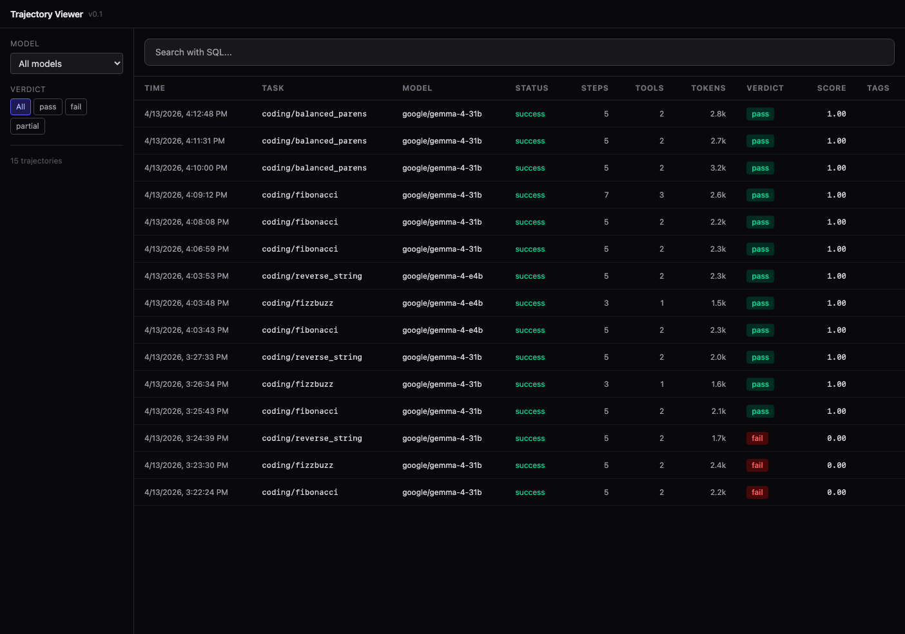
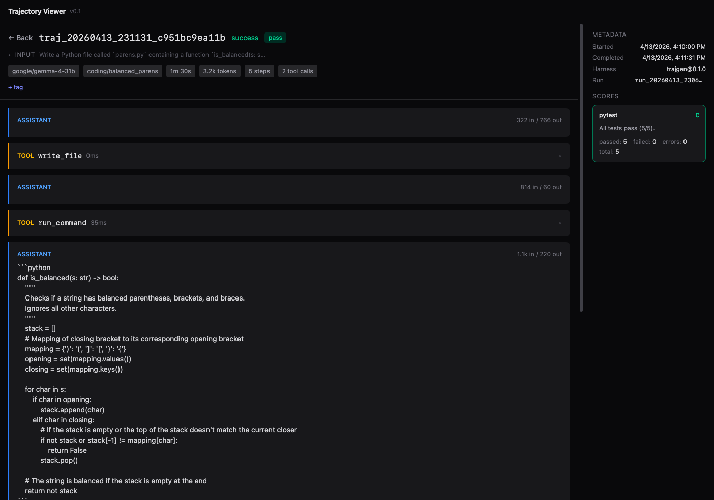

# Trajectory Viewer

Trajectory Viewer is a small tool for inspecting coding-model runs as trajectories: prompts, intermediate model and tool events, scores, and lightweight run metadata in one place.

It ships as a FastAPI + SQLite backend with a React frontend, plus a small generator CLI that can run fixture tasks or local model-backed tasks and post results into the viewer.

## Screenshots





## What It Does

- Browse trajectory runs in a compact table with model, task, status, score, token, and tool-call summaries.
- Open any trajectory and inspect the event timeline step by step.
- Search trajectories with SQL against a safe read-only view.
- Tag interesting runs for follow-up.
- Generate fixture-backed demo data or post locally generated trajectories from `trajgen`.
- Keep an Inspect-shaped trajectory format so logs remain easy to inspect outside this UI.

## Repo Layout

```text
apps/
  trajgen/              Generator CLI for tasks, replay, and posting trajectories
  viewer-api/           FastAPI app, SQLite schema, SSE endpoints
  viewer-web/           React + Vite frontend
packages/
  trajectory-schema/    Shared Pydantic models
docs/
  screenshots/          README images
```

## Quick Start

Requirements:

- Python 3.11+
- Node 20+
- `uv`

Install dependencies:

```bash
uv sync
cd apps/viewer-web && npm install
```

Run the demo:

```bash
cd apps/viewer-web && npm run build
cd ../viewer-api && uv run uvicorn viewer_api.app:app --port 8000
```

In a second terminal, seed the fixture trajectories:

```bash
uv run python scripts/seed.py
```

The app will be available at `http://localhost:8000`.

For local development:

```bash
cd apps/viewer-api && uv run uvicorn viewer_api.app:app --reload --port 8000
```

In another terminal:

```bash
cd apps/viewer-web && npm run dev
```

The frontend dev server listens on `http://localhost:5173` and proxies API requests to the backend.

## Useful Commands

```bash
cd apps/viewer-web && npm run build
uv run python scripts/seed.py
rm -rf apps/viewer-web/dist apps/viewer-api/data
```

`trajgen` examples:

```bash
uv run trajgen replay --fixtures 'apps/trajgen/fixtures/*.json'
uv run trajgen run --tasks apps/trajgen/tasks/quick.jsonl --no-post
```

## Notes

- The current viewer ingests compact trajectory JSON via `POST /api/trajectories`.
